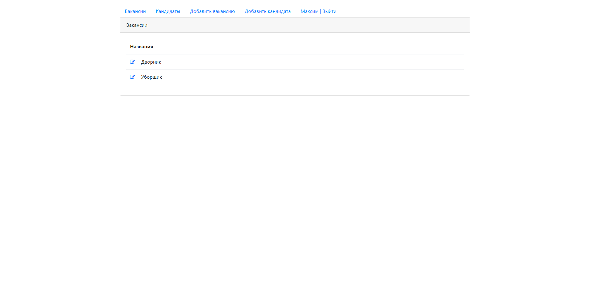
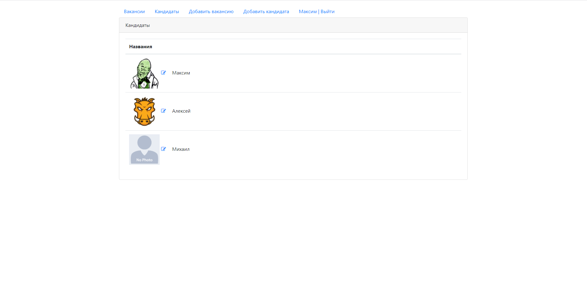
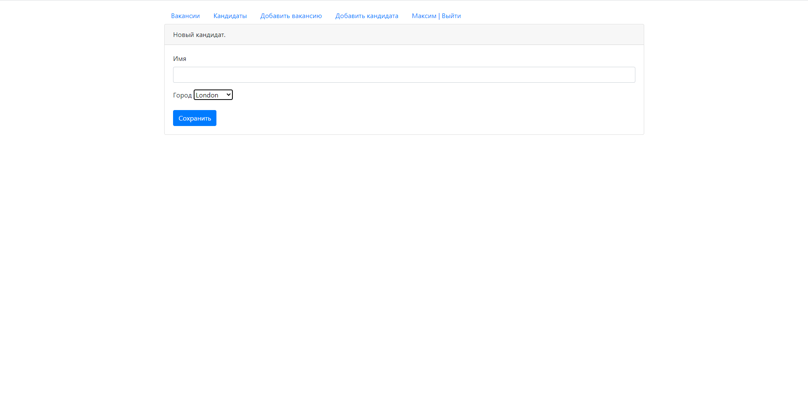
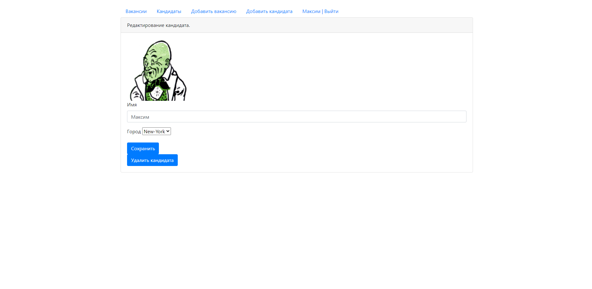

# job4j_dreamjob
Проект Dreamjob является реализацией сервиса по поиску работы и подбору персонала.
Сервис обладает функциями размещения вакансий и данных соискателей. Кроме того
в сервисе присутствует функция авторизации пользователей.

Список использованных технологий:
- Java 13, Maven. Junit 4, Mockito, PowerMock
- Servlet API, JSP, JSTL
- Postgresql, JDBC 
- HTML, CSS, JavaScript, Bootstrap 4, Ajax

